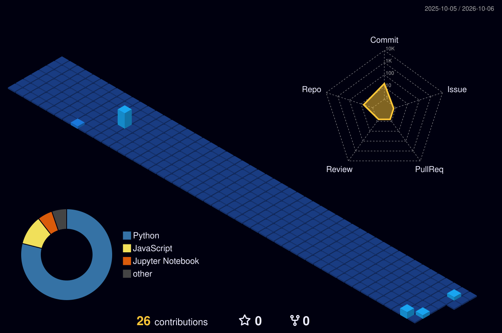

## 🧰 Tech stack

## 🪪 At a glance

## 🚀 Projects
| Project | What it does | Stack |
|---|---|---|
| **Intelligent Stock Market Prediction** | Forecasts prices from historical data; evaluated with MAE, RMSE, R² | Python, Flask, Scikit-learn, Pandas |
| **AI Sales Agent & CRM** | Automates lead engagement, qualification and follow-ups | Python, Conversational AI, APIs |
| **Vision Walkers** | Assistive shoes with obstacle detection, haptic and audio alerts, SOS | ESP32, ToF sensors, Embedded C/C++ |

## 🏆 Highlights
Oracle OCI 2025 AI Foundations Associate · Smart India Hackathon 2026 (internal shortlist) · Conference paper on closed-loop safety in regenerative medicine

## 🏙️ Contribution city
<picture>
  
</picture>

## 📫 Connect

[GitHub](https://github.com/YOUR-USERNAME) · [LinkedIn](https://www.linkedin.com/in/YOUR-LINKEDIN) · [Email](mailto:vvignesh05067@gmail.com)
